# Hi Tuto — AI-Powered Generative Learning Platform

> Enter a topic. Get a course. Learn interactively.

Hi Tuto is a generative learning platform that transforms any topic (or uploaded PDF) into a structured, interactive course. Lessons are generated just-in-time as rich HTML capsules rendered in sandboxed iframes, assisted by an AI text tutor and a real-time voice instructor. Private learning observability turns lesson activity, practice results, and tutor usage into evidence-backed personal insights without sharing or ranking learners.

---

## Table of Contents

1. [Product Overview](#product-overview)
2. [System Architecture](#system-architecture)
3. [Technology Stack](#technology-stack)
4. [Database Design](#database-design)
5. [Agent System](#agent-system)
6. [Course Generation Pipeline](#course-generation-pipeline)
7. [Tutor Agent](#tutor-agent)
8. [Voice Instructor](#voice-instructor)
9. [Learning Observability & Insights](#learning-observability--insights)
10. [RAG — Document Knowledge Layer](#rag--document-knowledge-layer)
11. [Capsule Security System](#capsule-security-system)
12. [A2UI — Declarative Widget System](#a2ui--declarative-widget-system)
13. [Frontend Architecture](#frontend-architecture)
14. [API Reference](#api-reference)
15. [Authentication & Authorization](#authentication--authorization)
16. [Deployment & Infrastructure](#deployment--infrastructure)
17. [Quick Start](#quick-start)
18. [Repository Layout](#repository-layout)
19. [Environment Variables](#environment-variables)

---

## Product Overview

Hi Tuto reimagines online learning by replacing pre-authored static content with AI-generated, interactive micro-lessons. The learner's journey:

1. **Enter a topic** (e.g., "Quantum Mechanics") or **upload a PDF/document**
2. The system **plans a locked lesson roadmap** (3–6 lessons, prerequisite-ordered)
3. Lessons are **generated just-in-time** as interactive HTML capsules
4. Each lesson renders in a **sandboxed iframe** with canvases, interactive controls, and images
5. An **AI tutor** answers questions via trusted React widgets (quizzes, flashcards, diagrams, charts)
6. A **voice instructor** teaches on top of the capsule in real-time, observing and driving the page
7. The private **Learning insights** view summarizes active time, answer correctness, lesson progress, tutor usage, interests, and supported struggle signals

### Key Differentiators

- **Generative, not static** — every course is unique, tailored to the topic
- **Interactive capsules** — not slides or text; each lesson is a mini web-app with canvases, controls, and visualizations
- **Document-grounded courses** — upload a PDF and get a course that teaches its content with citations
- **Dual AI assistance** — text tutor (function-calling → validated widgets) + voice instructor (OpenAI Realtime S2S)
- **Private learning insights** — immediate first-party event capture, deterministic 7-day/30-day projections, and optional evidence-bound AI wording
- **Security-first rendering** — untrusted HTML is gated by a strict postprocess check + CSP sandbox
- **Human-in-the-loop** — optional teacher review of outlines and lessons before they go live

---

## System Architecture

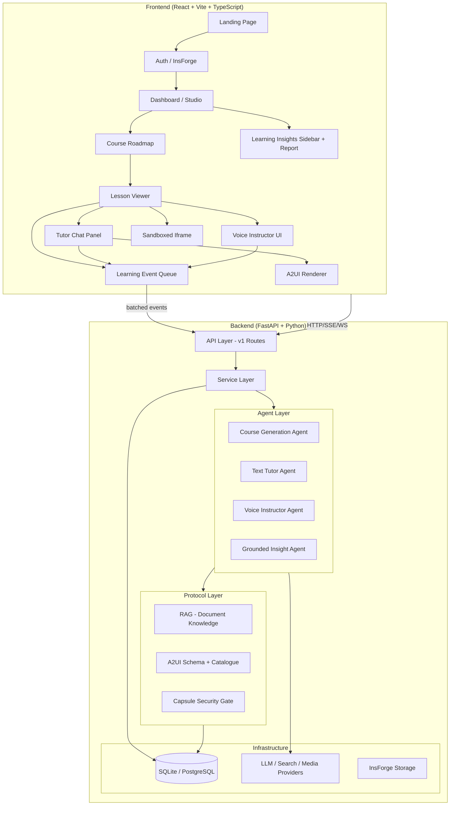

### Layering Rules

- **API layer** (`api/v1/`) — thin HTTP/WebSocket/SSE handlers; no business logic
- **Service layer** (`services/`) — orchestration, projections, state transitions
- **Agent layer** (`coursegen/`, `tutor/`, `voice/`) — AI agent implementations; **never cross-import each other**
- **Insights module** (`insights/agent.py`, `services/insight_service.py`) — deterministic user-scoped projections plus optional evidence-bound wording; never imports a teaching agent
- **Protocol layer** (`rag/`, `a2ui/`, `capsule/`) — shared contracts; **never import agents**
- **Infrastructure** (`core/`, `models/`, `providers/`) — database, config, external service adapters

---

## Technology Stack

| Layer | Technology |
|-------|-----------|
| **Backend** | Python 3.11, FastAPI, SQLAlchemy ORM, LangGraph, Pydantic |
| **Frontend** | React 18, TypeScript, Vite 5, Tailwind CSS 3.4 |
| **Auth & Storage** | InsForge (`@insforge/sdk`, JWT HS256) |
| **LLM** | OpenAI-compatible (Nebius Token Factory, GMI Cloud) — model: `zai-org/GLM-5.2` |
| **Voice** | OpenAI Realtime S2S (`gpt-realtime-2.1`) |
| **Image Generation** | TokenRouter (Gemini Flash Lite) / GMI Cloud |
| **3D Meshes** | Hunyuan 3D (self-hosted / Tencent Cloud / Atlas Cloud) |
| **Audio/TTS** | GMI Cloud (Inworld TTS 1.5 Mini) |
| **Web Search** | You.com API / Exa API |
| **Embeddings** | Nebius (Qwen3-Embedding-8B, dim 4096) |
| **Database** | SQLite (dev) / PostgreSQL + pgvector (prod) |
| **Maps** | OpenStreetMap (Leaflet tiles + Nominatim geocoding) |
| **Observability** | LangSmith (opt-in tracing per agent) |
| **Learning Insights** | First-party event log, deterministic 7d/30d projections, optional grounded LLM report |
| **CI/CD** | GitHub Actions (ruff lint + pytest) |
| **Math Rendering** | KaTeX (frontend) |

---

## Database Design

### Entity-Relationship Diagram

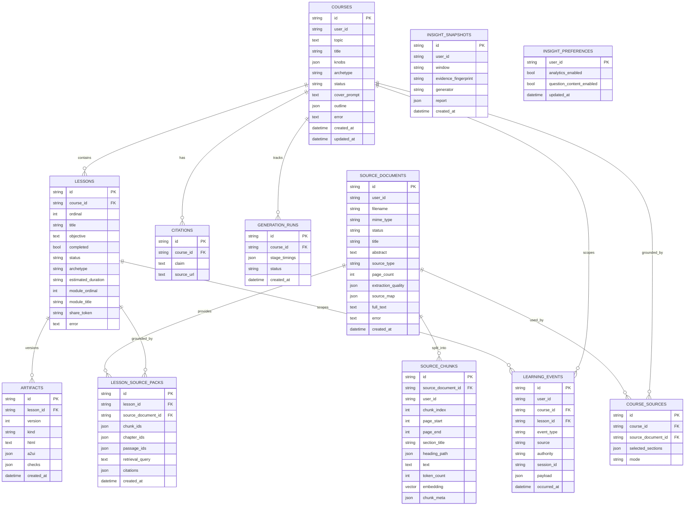

### Core Tables

| Table | Purpose | Key Statuses |
|-------|---------|-------------|
| **courses** | Top-level container; holds generation config (`knobs` JSON) | `generating` → `outline_review` → `ready` / `failed` |
| **lessons** | Individual lesson within a course, ordered by `ordinal` | `pending` → `generating` → `awaiting_review` → `ready` / `failed` |
| **artifacts** | Versioned lesson output (HTML or A2UI JSON); never overwritten | `kind`: `html` or `a2ui` |
| **citations** | Research citations attached to a course | — |
| **generation_runs** | Async progress tracking with stage timings | `running` → complete |

### Document-Grounding Tables

| Table | Purpose |
|-------|---------|
| **source_documents** | Uploaded PDF/text files with parse metadata (`source_map` JSON) |
| **source_chunks** | Tokenized text segments with optional pgvector embeddings |
| **course_sources** | Many-to-many link between courses and source documents |
| **lesson_source_packs** | Per-lesson grounding evidence: chunk IDs, chapter IDs, citations |

### Learning-Insight Tables

| Table | Purpose |
|-------|---------|
| **learning_events** | Append-only, deduplicated user activity with bounded payloads and optional course/lesson scope |
| **insight_snapshots** | Cached, evidence-fingerprinted 7-day/30-day reports from deterministic or agent wording |
| **insight_preferences** | Per-user collection and optional question-content controls |

### Ownership & Security

- Everything scoped to `user_id` (top-level index on courses/source_documents)
- Insight events, snapshots, and preferences are always queried by the authenticated `user_id`
- Children inherit ownership via foreign keys
- Cascade deletes: `Course` → `Lessons` → `Artifacts` → `Citations`
- **Share links**: `lessons.share_token` is the only exception — an unguessable token granting anonymous read-only access

### Persistence Strategy

- **Dev**: SQLite (`sqlite:///./hituto.db`) with additive column migrations via `_ensure_added_columns()`
- **Prod**: PostgreSQL with Alembic migrations (`alembic/versions/`)
- **Insight migration**: `a7b8c9d0e1f2_personal_learning_insights.py` creates the production event, snapshot, and preference tables
- **Vector store**: `VECTOR_STORE=pgvector` enables semantic retrieval; `keyword` for SQLite fallback
- **Uploads**: InsForge Storage (remote) or local disk (`UPLOAD_DIR`)

---

## Agent System

Hi Tuto has three independent interactive agents that never cross-import each other. Learning insights adds a separate, bounded reporting agent that receives approved evidence from the service layer; it does not orchestrate or import the teaching agents.

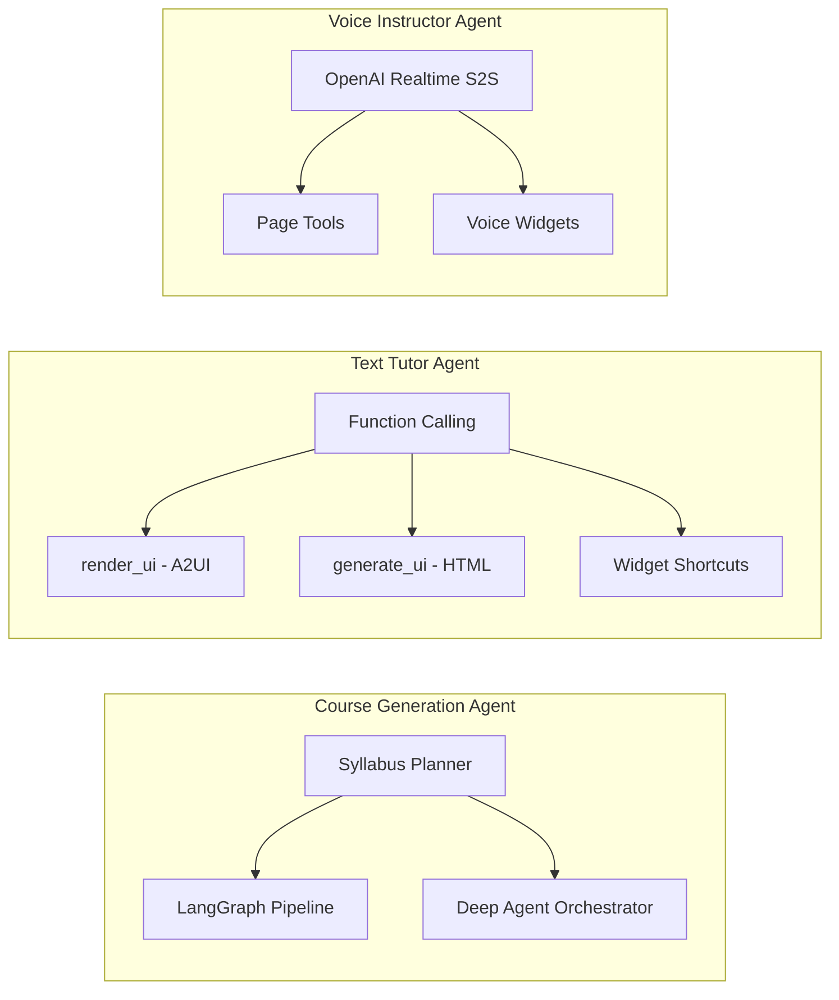

### Design Principles

1. **Import boundaries enforced** — agents never import each other; protocols never import agents
2. **Fail-closed** — any invalid tool call falls back to plain text (never renders broken UI)
3. **Dual-engine with fallback** — Deep Agent tries first, deterministic LangGraph catches failures
4. **Security gate on all output** — untrusted HTML passes through `postprocess()` before serving
5. **Evidence before interpretation** — insight metrics and signals are deterministic; agent wording is optional and schema-validated

---

## Course Generation Pipeline

### Two-Engine Architecture

Lesson generation has two implementations behind one entry point, selected by `DEEP_AGENTS_ENABLED`:

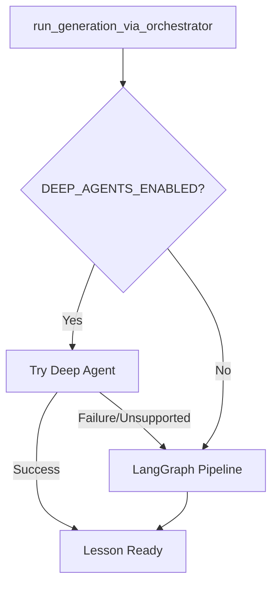

### LangGraph Pipeline (Default — Production Path)

A deterministic 6-stage state machine:

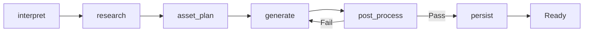

| Stage | What it does |
|-------|-------------|
| **interpret** | Load course/lesson from DB, build lesson plan (`planner.build_lesson_plan`) |
| **research** | Document-grounded → RAG context; else web search (You.com/Exa) |
| **asset_plan** | Compute (viz lab) + 3D mesh generation (Hunyuan), routed by specialist |
| **generate** | LLM authors the capsule HTML from prompts + research + plan |
| **post_process** | Security gate (`capsule/postprocess.py`) — validate, sanitize, inject bridge |
| **persist** | Write versioned `Artifact`, inline compute/mesh, emit SSE progress 100% |

The repair loop retries `generate → post_process` up to `MAX_GEN_RETRIES` (2) times.

### Deep Agent (Flag-Gated)

A `deepagents.create_deep_agent` orchestrator that delegates via the `task` tool:

```mermaid
flowchart TD
    ORCH[Orchestrator] --> RES[Researcher]
    ORCH --> DS[Data Synthesizer]
    ORCH --> VE[Viz Engineer]
    ORCH --> MV[Mesh Viz]
    ORCH --> AC[Animation Coder]
    ORCH --> IA[Image Artist]
    ORCH --> CA[Capsule Author]
    ORCH --> QA[QA Reviewer]
    ORCH --> SP[Subject Specialist]
    
    RES -->|web_search| Facts
    DS -->|synthesize_dataset| JSON
    VE -->|run_viz_lab| Plots
    MV -->|generate_meshes| GLBs
    CA -->|write_file| HTML[/build/capsule.html]
    QA -->|capsule_checks| Verdict
```

#### Role Subagents

| Subagent | Responsibility | Tools |
|----------|---------------|-------|
| **researcher** | Gather 3–6 grounded facts with source URLs | `web_search` |
| **data_synthesizer** | Generate seeded datasets for data-driven lessons | `synthesize_dataset` |
| **viz_engineer** | Server-side visualization (plots, traces, charts) | `run_viz_lab` |
| **mesh_viz** | Generate Hunyuan 3D meshes for specimen Studio lessons | `generate_studio_meshes` |
| **animation_coder** | Write canvas animation modules | `write_file` |
| **image_artist** | Plan image prompts for the capsule | `write_file` |
| **capsule_author** | Author the final HTML capsule | `write_file` |
| **qa_reviewer** | Validate capsule quality + security | `capsule_checks` |
| **subject_specialist** | Domain-specific review (maths: `check_katex`; science: `run_viz_lab`) | varies |

#### Subject Specialist Routing

```python
# Topic → Specialist mapping (registry.py)
"math|algebra|calculus|geometry|..." → maths-specialist (check_katex)
"physics|biology|chemistry|..."     → science-specialist (run_viz_lab, generate_mesh)
```

### Syllabus Planning

The syllabus planner also has a Deep Agent path (flag-gated) with a deterministic fallback:

- **Document-grounded** courses: Teaching map → structural chapter-to-lesson mapping
- **Free-topic** courses: `build_syllabus()` → 3–6 prerequisite-ordered concept capsules

### Presentation Shells

`resolve_presentation()` picks the capsule chrome:

| Shell | Description | Trigger |
|-------|-------------|---------|
| **page** | Default scrollable interactive mini-app | Default |
| **studio** | Validated stage-first lab: specimen, simulation, or process cutaway | `presentation=studio`, `needs_3d=true`, or spatial topic |
| **slide** | Stepped slide deck with prev/next controls | `presentation=slide` |

Initial Studio lessons use a typed `StudioManifest` and a server-owned renderer. The router chooses
the interaction mode from the topic (or `studio_mode` knob), while only specimen mode can request
an image-to-3D mesh; simulations and cutaways stay deterministic and procedural.

### Human-in-the-Loop (HITL)

- **Outline review** (`review_outline`): LLM drafts a chapter outline → teacher approves/edits/revises
- **Lesson review** (`require_teacher_review`): Generated lesson pauses at `awaiting_review` → teacher approves/rejects
- Implemented via LangGraph durable `interrupt()` with `AsyncSqliteSaver` checkpointer

---

## Tutor Agent

The text tutor answers learner questions via LLM **function-calling** with server-side validation. The model's tool call is never raw-rendered — it's Pydantic-validated and mapped to trusted React widgets.

### Architecture

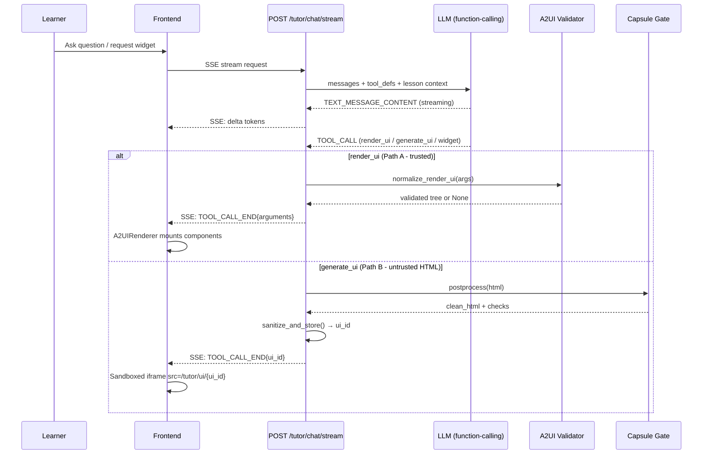

### Tool Definitions

| Tool | Type | Description |
|------|------|-------------|
| `render_ui` | A2UI tree | Declarative component tree (preferred path) |
| `generate_ui` | HTML escape hatch | Self-contained HTML for bespoke visuals |
| `create_quiz` | Widget | Multi-question quiz (MCQ, numeric, slider) |
| `show_flashcards` | Widget | Flip-card study deck |
| `show_code_exercise` | Widget | Interactive coding challenge |
| `create_game` | Widget | Educational mini-game |
| `show_diagram` | Widget | Mermaid-style flowchart/mindmap |
| `show_formula_calculator` | Widget | Interactive formula with sliders |

### Streaming (AG-UI Frames)

The tutor streams over SSE using AG-UI-style frames:

```
RUN_STARTED → TEXT_MESSAGE_CONTENT{delta} → TOOL_CALL_START → TOOL_CALL_ARGS{delta} → TOOL_CALL_END{arguments} → RUN_FINISHED
```

The frontend progressively renders: text streams token-by-token, `render_ui` trees mount node-by-node as args stream in.

---

## Voice Instructor

A real-time voice teacher that **talks with the learner AND observes + drives the running lesson capsule**. Off by default; needs `VOICE_ENABLED=true` + `OPENAI_REALTIME_API_KEY`.

### Architecture

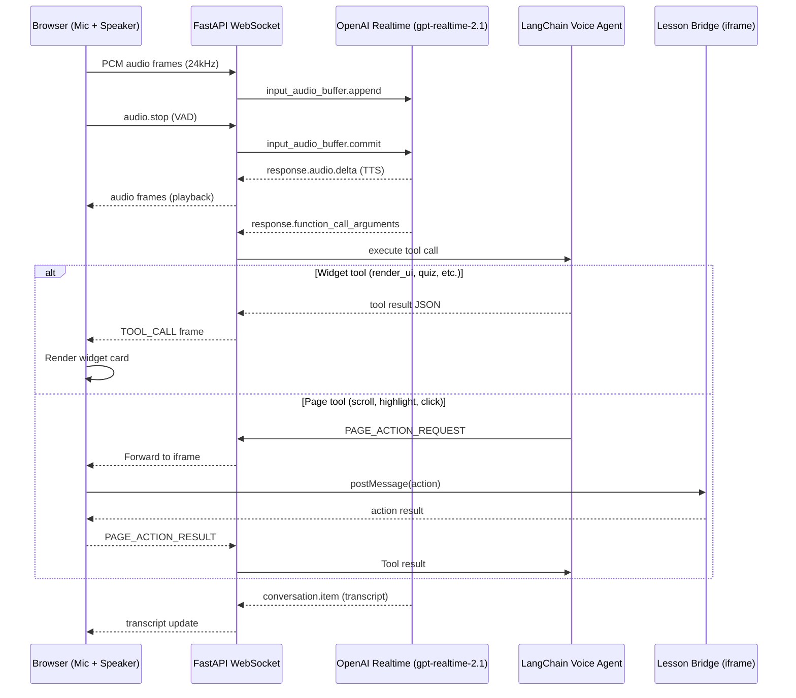

### Two Tool Families

**Widget Tools** — shared with the text tutor (same `_TOOL_DEFS`):
- `render_ui`, `generate_ui`, `create_quiz`, `show_flashcards`, `show_code_exercise`, `create_game`, `show_diagram`, `show_formula_calculator`

**Page Tools** — unique to voice, drive the capsule via the lesson bridge:
- `observe_page` — get the current page snapshot (headings, sections, controls)
- `scroll_to` — scroll to a heading/section/element by ID
- `scroll_by` — scroll by a relative amount
- `highlight` — highlight an element with a visual indicator
- `click` — click a button/control
- `set_value` — set an input/slider/control value

### Key Features

- **Barge-in support** — learner speaking interrupts active TTS playback
- **Page observation** — voice agent reads the capsule's live state via the bridge
- **Agent cursor overlay** — visual indicator showing where the voice agent is pointing
- **15-minute session max** with 60-second idle timeout
- **Graceful degradation** — if voice is not configured, the button hides entirely

---

## Learning Observability & Insights

Hi Tuto records bounded learning events immediately and computes personal insights without making lesson, quiz, tutor, or voice interactions wait for an LLM. The deterministic projection is always the source of truth; the optional `insight_agent` may only explain evidence that the service supplies.

### Event-to-Insight Flow

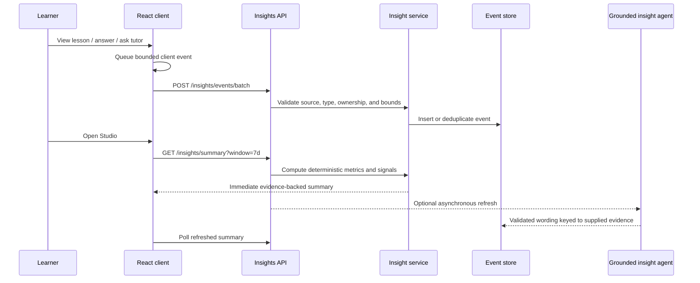

### What Is Measured

- Visible, active lesson time with idle/background-tab exclusion
- Lesson views and trusted server-side completion
- Quiz totals, correctness, answer pacing, hints, explanations, attempts, and retries
- Text and voice tutor questions, finished replies, and positive response latency
- Bounded capsule section/control interactions emitted through the lesson bridge
- Recent activity, activity-backed interests, and corroborated struggle signals

“Answer quality” means observable quiz correctness. Tutor response time means service latency, not the quality of an answer. A struggle signal requires multiple supporting observations; one wrong answer, revisit, or question is never treated as proof of difficulty.

### Projection and Agent Rules

- The service computes 7-day and 30-day metrics deterministically from owned events.
- The agent receives only approved observations and evidence keys.
- Every agent insight must cite supplied evidence and pass schema validation.
- Invalid, unsupported, unavailable, or stale agent output falls back to the deterministic report.
- Event ingestion is idempotent and accepts at most 50 eligible client events per batch.
- Server-only completion and tutor lifecycle events cannot be forged through the public batch endpoint.

### Studio Experience

The Studio keeps courses as the primary workspace and places **Learning insights** in the secondary column. The compact sidebar shows four key metrics, Tuto’s evidence-backed take, struggle/interest previews, and the next recommended action. Detailed patterns and recent activity open in an accessible dialog instead of lengthening the dashboard. On small screens, the panel starts as a 115px private summary and expands on demand.

The dashboard hero is intentionally concise: one learning prompt plus one resume-course action. Shelf counts, completed-lesson totals, and activity metrics are not repeated outside the insights surface.

### Privacy and Data Control

- Insights are private to the authenticated owner; there is no teacher, parent, classroom, ranking, or cross-user view.
- Collection can be paused independently of course usage.
- Optional bounded tutor-question content is separately controlled and disabled by default.
- Raw answers, tutor replies, keystrokes, mouse trails, scroll coordinates, and background-tab time are not stored.
- `DELETE /insights/data` removes the current user’s events and snapshots while preserving courses and lessons.

### Implementation Map

| Layer | Location | Responsibility |
|-------|----------|----------------|
| API | `backend/app/api/v1/insights.py` | Authenticated thin routes |
| Service | `backend/app/services/insight_service.py` | Validation, ingestion, metrics, projections, refresh, deletion |
| Agent | `backend/app/insights/agent.py` | One bounded structured-output wording call |
| Models | `backend/app/models/insight.py` | Events, snapshots, preferences |
| Schemas | `backend/app/schemas/insight.py` | Event, metric, report, and preference contracts |
| Client queue | `frontend/src/lib/learningEvents.ts` | Stable IDs, batching, lifecycle flush, active-time session |
| UI | `frontend/src/features/insights/` | Sidebar, detailed report, privacy controls, responsive states |

The full requirements, evidence policy, formulas, UI states, and implementation checklist live in [`specs/insights/`](./specs/insights/README.MD).

---

## RAG — Document Knowledge Layer

Turns an uploaded PDF/Markdown/text into structured, retrievable knowledge that grounds lessons and tutor answers with citations.

### Ingest Pipeline

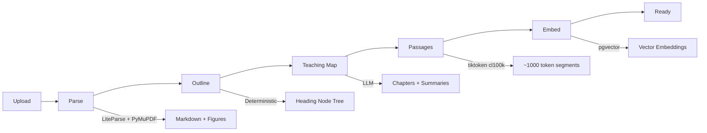

| Phase | Status | What Happens |
|-------|--------|-------------|
| **parse** | `parsing` | LiteParse + PyMuPDF dual path → canonical Markdown + manifest + figures |
| **outline** | `outlining` | Deterministic node tree from Markdown headings (never LLM-written) |
| **teaching_map** | `mapping` | LLM extracts chapters referencing outline nodes; deterministic fallback |
| **passages** | `chunking` | Per-chapter: summary row + recursively split passage chunks (~1000 tokens) |
| **embed** | `indexing` | pgvector on Postgres; `None` on SQLite (keyword fallback) |

### Retrieval Strategy

Hybrid two-stage:
1. `route_chapters()` — ranks the 3 best teaching chapters
2. `retrieve_passages()` — searches passages within selected chapters (cosine similarity + keyword fallback)

### Context Modes

| Mode | When Used | How |
|------|-----------|-----|
| **chapter** | Lesson has `LessonSourcePack.chapter_ids` | Constrained to pre-assigned chapters |
| **retrieve** | Live query over the full teaching map | Two-stage hybrid search |
| **none** | No source document attached | Web search only |

### Grounding Validation

`check_grounding()` flags:
- Missing citations (claims not backed by source)
- Foreign citations (references to content not in the source)
- Verbatim copying (18-word sliding window check)

---

## Capsule Security System

Generated lesson HTML is **untrusted**. The capsule system is the gate that decides whether HTML may ship.

### Security Model

```mermaid
flowchart TD
    HTML[Generated HTML] --> PP[postprocess.py]
    PP -->|Validate| CHECKS{Checks Pass?}
    CHECKS -->|Yes| INJECT[Inject Bridge + Runtime]
    CHECKS -->|No| REJECT[Reject → Retry/Fail]
    INJECT --> SERVE[Serve with CSP Headers]
    SERVE --> IFRAME[sandbox="allow-scripts" iframe]
```

### Postprocess Gate (`postprocess.py`)

**Rejects** if:
- `window.parent` / `window.top` / `localStorage` / `sessionStorage` access detected
- Placeholder tokens (`lorem ipsum`, `todo`, `{{`, `[image]`)
- Missing structure (`<body>`, canvas, controls, ≥1 image)
- Disallowed external `<script src>` (only Tailwind, Three.js, GLTFLoader, Chart.js allowed)

**Normalizes**:
- Images → lazy `go-data-src` loader (resolved at runtime via same-origin `/gen`, `/image`)
- Injects the **lesson bridge** (host ↔ capsule postMessage protocol)
- Injects mesh runtime (Three.js + GLTFLoader for 3D capsules)

### Content Security Policy

```
default-src 'none';
img-src 'self' data: blob:;
script-src 'self' 'unsafe-inline' https://cdn.tailwindcss.com [pinned CDNs];
style-src 'self' 'unsafe-inline' https://fonts.googleapis.com;
font-src https://fonts.gstatic.com data:;
connect-src 'self' blob:;
frame-ancestors 'self' <frontend_origin>
```

### Lesson Bridge (Host ↔ Capsule Communication)

A versioned `postMessage` protocol injected into every capsule:

| Direction | Commands |
|-----------|----------|
| **Host → Capsule** | `snapshot`, `scroll_to`, `highlight`, `click`, `set_value`, `edit_mode`, `get_html` |
| **Capsule → Host** | `snapshot_reply`, `action_result`, `learner_interaction` |

Identity verified via `event.source === iframe.contentWindow` (not origin — sandbox has opaque origin).

---

## A2UI — Declarative Widget System

A2UI (Agent-to-UI) is a trusted, theme-locked declarative component system. The LLM emits a JSON tree of typed nodes; the backend validates it; the frontend renders it from a fixed React registry. **No raw HTML ever reaches the DOM.**

### Node Types

| Node | Props | Description |
|------|-------|-------------|
| `stack` | `direction`, `gap` | Layout container (vertical/horizontal) |
| `heading` | `text`, `level` | Section heading (h1–h3) |
| `text` | `text` | Paragraph of prose |
| `callout` | `text`, `variant` | Info/warning/success/danger box |
| `math` | `latex`, `display` | KaTeX-rendered mathematics |
| `steps` | `steps[]` | Numbered step-by-step list |
| `quiz` | `topic`, `questions[]` | Interactive multi-question quiz |
| `table` | `headers`, `rows`, `caption` | Data/comparison table |
| `chart` | `kind`, `labels`, `series` | Bar or line chart (hand-drawn SVG) |
| `slider` | `label`, `min/max/step`, `readouts[]` | Interactive range input with computed readouts |
| `diagram` | `nodes`, `edges`, `direction` | Auto-laid-out node/edge graph (SVG) |

### Validation Rules

- **Max depth**: 6 levels
- **Max nodes**: 60 per tree
- **Props validation**: Each node type has a Pydantic model with strict field validation
- **Alias tolerance**: Accepts common model variants (`content`→`text`, `items`→`steps`, etc.)
- **Fail-closed**: Invalid tree → `None` → falls back to text or `generate_ui`

### Example A2UI Tree

```json
{
  "title": "Newton's Laws",
  "intent": "Interactive overview of the three laws of motion",
  "root": {
    "type": "stack",
    "props": { "direction": "vertical", "gap": "md" },
    "children": [
      { "type": "heading", "props": { "text": "Newton's Three Laws", "level": 1 }, "children": [] },
      { "type": "text", "props": { "text": "The foundation of classical mechanics." }, "children": [] },
      { "type": "math", "props": { "latex": "F = ma", "display": true }, "children": [] },
      { "type": "slider", "props": {
          "label": "Mass (kg)", "min": 1, "max": 100, "step": 1, "value": 10, "unit": "kg",
          "readouts": [{ "label": "Force at 9.8 m/s²", "expr": "9.8 * x", "unit": "N" }]
        }, "children": [] }
    ]
  }
}
```

---

## Frontend Architecture

### Application Structure

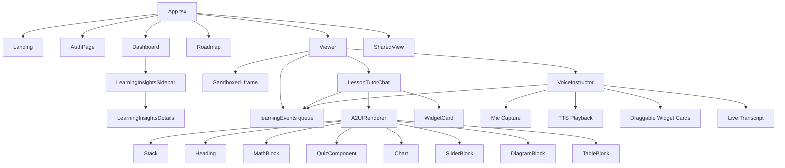

### Pages & Features

| Route | Component | Description |
|-------|-----------|-------------|
| `#` | `Landing` | Marketing page with waitlist signup |
| `#auth` | `AuthPage` | InsForge sign-in/sign-up |
| `#studio` | `Dashboard` | Compact resume hero, course search/filter grid, and private responsive learning insights |
| `#studio/course/{id}` | `Roadmap` | Chapter-grouped lesson list, outline review editor |
| `#studio/course/{id}/lesson/{id}` | `Viewer` | Iframe + tutor + voice side-by-side |
| `#s/{token}` | `SharedLessonView` | Public read-only shared lesson (no auth) |

### Key Components

| Component | File | Purpose |
|-----------|------|---------|
| `A2UIRenderer` | `components/A2UIRenderer.tsx` | Recursive tree walker mapping A2UI nodes → React |
| `LessonTutorChat` | `components/LessonTutorChat.tsx` | Chat panel with streaming + widget rendering |
| `VoiceInstructor` | `components/VoiceInstructor.tsx` | Voice session UI with audio, widgets, transcript |
| `QuizComponent` | `components/QuizComponent.tsx` | Multi-step quiz with scoring |
| `FlipCardComponent` | `components/FlipCardComponent.tsx` | Animated flashcard deck |
| `GameComponent` | `components/GameComponent.tsx` | Educational mini-game renderer |
| `GenerativeUiComponent` | `components/GenerativeUiComponent.tsx` | Sandboxed iframe for `generate_ui` HTML |
| `AgentCursorOverlay` | `components/AgentCursorOverlay.tsx` | Visual cursor for voice page tools |
| `CreateCourseModal` | `features/courses/CreateCourseModal.tsx` | Topic input + knobs + file upload |
| `Roadmap` | `features/roadmap/Roadmap.tsx` | Lesson list + outline HITL editor |
| `LearningInsightsSidebar` | `features/insights/LearningInsightsSidebar.tsx` | 7d/30d snapshot, metrics, signals, actions, privacy entry point |
| `LearningInsightsDetails` | `features/insights/LearningInsightsDetails.tsx` | Accessible full-report dialog for overview, patterns, and activity |
| `learningEvents` | `lib/learningEvents.ts` | Bounded client event queue, stable IDs, batching, and active-time lifecycle |

### Libraries

| Package | Purpose |
|---------|---------|
| `react` / `react-dom` 18 | UI framework |
| `katex` | LaTeX math rendering (A2UI `math` nodes) |
| `@insforge/sdk` | Auth (JWT) + waitlist table |
| `tailwindcss` 3.4 | Utility-first CSS |
| `vite` 5 | Dev server + bundler |
| `typescript` 5.5 | Type safety |

### Design System

- **Font**: System stack + `font-display` for headings
- **Colors**: `ink`, `ink-soft`, `ink-faint`, `cobalt`, `coral`, `grass`, `sand`, `paper`, `surface`
- **Spacing**: `sm` (8px), `md` (16px), `lg` (24px)
- **Animations**: `animate-bounce`, `animate-pulse`, `animate-spin-slow` for loading states
- **Icons**: Material Symbols Outlined

---

## API Reference

### Course Endpoints

| Method | Path | Description |
|--------|------|-------------|
| `POST` | `/courses` | Create a new course from topic + knobs |
| `GET` | `/courses` | List user's courses (search, filter by status) |
| `GET` | `/courses/{id}` | Get course detail with lessons |
| `PATCH` | `/courses/{id}` | Update course title |
| `DELETE` | `/courses/{id}` | Delete course (cascades) |
| `POST` | `/courses/{id}/refinements` | Refine a lesson with a prompt |
| `GET` | `/courses/{id}/events` | SSE progress stream |
| `GET` | `/courses/{id}/outline` | Get chapter outline (HITL) |
| `POST` | `/courses/{id}/outline/review` | Approve/edit/revise outline |

### Lesson Endpoints

| Method | Path | Description |
|--------|------|-------------|
| `POST` | `/courses/{cid}/lessons/{lid}/generate` | Generate a pending lesson |
| `POST` | `/courses/{cid}/lessons/{lid}/regenerate` | Regenerate an existing lesson |
| `POST` | `/courses/{cid}/lessons/{lid}/complete` | Mark lesson completed + prefetch next |
| `POST` | `/courses/{cid}/lessons/{lid}/review` | Approve/reject (HITL) |
| `GET` | `/courses/{cid}/lessons/{lid}/artifact` | Serve lesson HTML with CSP |
| `GET` | `/courses/{cid}/lessons/{lid}/artifact/a2ui` | Serve A2UI JSON artifact |
| `PUT` | `/courses/{cid}/lessons/{lid}/artifact` | Save edited HTML (edit mode) |
| `GET` | `/courses/{cid}/lessons/{lid}/source-pack` | Get RAG grounding pack |
| `POST` | `/courses/{cid}/lessons/{lid}/share` | Create public share link |
| `DELETE` | `/courses/{cid}/lessons/{lid}/share` | Revoke share link |

### Tutor Endpoints

| Method | Path | Description |
|--------|------|-------------|
| `POST` | `/courses/{cid}/lessons/{lid}/tutor/chat` | Non-streaming chat |
| `POST` | `/courses/{cid}/lessons/{lid}/tutor/chat/stream` | SSE streaming chat |
| `GET` | `/courses/{cid}/lessons/{lid}/tutor/ui/{ui_id}` | Serve stored generate_ui HTML |

### Voice Endpoint

| Method | Path | Description |
|--------|------|-------------|
| `WebSocket` | `/courses/{cid}/lessons/{lid}/voice/ws` | Real-time voice session |

### Source Document Endpoints

| Method | Path | Description |
|--------|------|-------------|
| `POST` | `/sources/upload` | Upload PDF/text/markdown |
| `GET` | `/sources` | List user's source documents |
| `GET` | `/sources/{id}` | Get source detail |
| `DELETE` | `/sources/{id}` | Delete source + artifacts |
| `GET` | `/sources/{id}/outline` | Get parsed document outline |
| `POST` | `/sources/{id}/courses` | Create course from source |

### Learning Insight Endpoints

All insight endpoints require authentication and scope reads/writes to the current `user_id`.

| Method | Path | Description |
|--------|------|-------------|
| `POST` | `/insights/events/batch` | Accept up to 50 eligible, bounded client events; return accepted/duplicate counts |
| `GET` | `/insights/summary?window=7d\|30d` | Return deterministic metrics, signals, activity, action, and current validated report |
| `POST` | `/insights/refresh?window=7d\|30d` | Request best-effort asynchronous agent wording refresh (`202`) |
| `GET` | `/insights/preferences` | Read collection and optional question-content controls |
| `PATCH` | `/insights/preferences` | Update one or both supported preference flags |
| `DELETE` | `/insights/data` | Delete the current user’s events and snapshots without deleting courses |

### Media/Tool Endpoints

| Method | Path | Description |
|--------|------|-------------|
| `GET` | `/gen?prompt=&aspect=` | Generate image from prompt |
| `GET` | `/image?query=&aspect=` | Retrieve a photo-style image |
| `GET` | `/audio?prompt=&kind=` | Generate TTS audio |
| `GET` | `/mesh?key=` | Serve a cached Hunyuan GLB mesh |
| `GET` | `/maps/geocode?q=` | Geocode a location (Nominatim) |
| `GET` | `/maps/tiles/{z}/{x}/{y}.png` | OSM tile proxy |

### Public Share

| Method | Path | Description |
|--------|------|-------------|
| `GET` | `/shared/lessons/{token}` | Public lesson metadata |
| `GET` | `/shared/lessons/{token}/artifact` | Public lesson HTML (no auth) |

---

## Authentication & Authorization

### InsForge JWT Flow

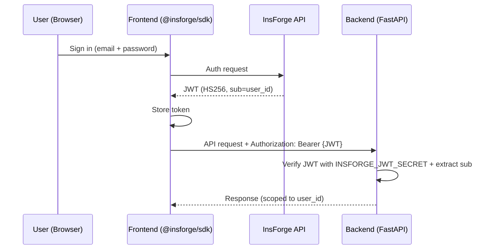

### Auth Modes

| Mode | Config | Behavior |
|------|--------|----------|
| **Production** | `INSFORGE_JWT_SECRET` (+ frontend `VITE_INSFORGE_*`) | JWT verified with shared HS256 secret |
| **Development** | `AUTH_DISABLED=1` | All requests use `user_id="dev"` |

### Token Delivery

- **Standard routes**: `Authorization: Bearer {token}` header
- **SSE/EventSource**: `?access_token={token}` query param (EventSource can't set headers)
- **WebSocket (voice)**: `?access_token={token}` query param (browsers can't set WS headers)
- **Iframe artifacts**: `?access_token={token}` query param (cross-origin iframe loads)

---

## Deployment & Infrastructure

### Backend (API)

Run FastAPI with Postgres (prod) or SQLite (dev). There is no hosted deploy blueprint in
this repo — point the frontend at whatever host you use via `VITE_API_BASE_URL`.

| Piece | Detail |
|-------|--------|
| **App** | `uv sync --all-extras` then `uvicorn app.main:app --port 8077` |
| **DB** | Postgres via `DATABASE_URL` + `VECTOR_STORE=pgvector`, or SQLite for local |
| **Health** | `GET /health` |
| **Migrate** | Postgres → `alembic upgrade head`; SQLite → `init_db()` / optional seed dump |

`app/main.py` can also mount a built SPA from `backend/static` (override with `SPA_DIST`)
same-origin when present. Waitlist and storage stay on InsForge.

### Progress & Real-time Updates

- **SSE (Server-Sent Events)** — course generation progress streams to the frontend
- **In-memory broker** (`core/progress.py`) — process-local pub/sub; last-event replay for late subscribers
- **WebSocket** — voice instructor bidirectional audio + control frames

### Observability

- **LangSmith** (opt-in): traces per agent with stable tags
  - `agent:coursegen` — lesson generation + syllabus planning
  - `agent:tutor` — text tutor (POST + SSE stream)
  - `agent:voice` — voice instructor LLM / generate_ui
  - `agent:rag` — document ingest / teaching-map LLM

### CI/CD (GitHub Actions)

```yaml
# .github/workflows/ci.yml
- ruff check backend/app     # Linting
- make test-backend           # Pytest
```

### Provider Fallback Strategy

| Service | Primary | Fallback |
|---------|---------|----------|
| **LLM** | Nebius Token Factory (GLM-5.2) | Any OpenAI-compatible endpoint |
| **Image** | TokenRouter (Gemini Flash Lite) | GMI Cloud → SVG gradient placeholder |
| **Audio** | GMI Cloud TTS | Silent WAV |
| **3D Mesh** | Self-hosted Hunyuan → Tencent → Atlas | Procedural (no mesh) |
| **Search** | You.com | Exa |
| **Embeddings** | Nebius (Qwen3-Embedding-8B) | Keyword fallback on SQLite |
| **Voice** | OpenAI Realtime S2S | Feature disabled (button hidden) |

---

## Quick Start

### Prerequisites

- Python 3.11+
- Node.js 18+
- An LLM API key (Nebius Token Factory, OpenAI-compatible, etc.)

### Backend

```bash
cd backend
python -m venv .venv
source .venv/bin/activate
pip install -e .

# Copy and fill in API keys
cp .env.example .env
# Edit .env: set LLM_API_KEY (Claude key), optionally AUTH_DISABLED=1 for local demo
# Default LLM is Anthropic OpenAI-compat: https://api.anthropic.com/v1

# Start the server
uvicorn app.main:app --reload --port 8077
```

### Frontend

```bash
cd frontend
npm install
npm run dev
```

Open http://localhost:5173 — Vite proxies API routes to `:8077`.

### InsForge (Auth + Storage)

Project: **TrailLearn** (`https://8xdj824y.us-east.insforge.app`)

Frontend env (`frontend/.env`):
```bash
VITE_INSFORGE_URL=https://8xdj824y.us-east.insforge.app
VITE_INSFORGE_ANON_KEY=
# VITE_AUTH_DISABLED=1   # skip login for local demo
```

Backend env (`backend/.env`):
```bash
INSFORGE_BASE_URL=https://8xdj824y.us-east.insforge.app
INSFORGE_API_KEY=ik_...          # storage / admin key
INSFORGE_JWT_SECRET=             # npx @insforge/cli secrets get JWT_SECRET
# AUTH_DISABLED=1                # for local demo
```

---

## Repository Layout

```
hituto/
├── backend/
│   ├── app/
│   │   ├── api/v1/            # Thin FastAPI route handlers
│   │   │   ├── courses.py     # Course CRUD, artifacts, SSE, share
│   │   │   ├── insights.py    # Private events, summaries, refresh, preferences, deletion
│   │   │   ├── tutor.py       # Chat + streaming + generate_ui serve
│   │   │   ├── voice.py       # WebSocket voice session
│   │   │   ├── sources.py     # Document upload, outline, course-from-source
│   │   │   ├── tools.py       # /gen, /image, /audio, /mesh, /maps
│   │   │   └── shared.py      # Public share token routes
│   │   ├── coursegen/         # AGENT: syllabus + lesson generation
│   │   │   ├── agents/        # Deep Agent orchestrator + role subagents
│   │   │   │   ├── orchestrator.py
│   │   │   │   ├── lesson_agent.py
│   │   │   │   ├── syllabus_planner.py
│   │   │   │   ├── tools.py
│   │   │   │   ├── registry.py
│   │   │   │   ├── specialists.py
│   │   │   │   └── roles/     # researcher, capsule_author, qa_reviewer, etc.
│   │   │   ├── graph.py       # LangGraph 6-stage pipeline
│   │   │   ├── planner.py     # Lesson/syllabus planning
│   │   │   ├── state.py       # Typed pipeline state (GenState)
│   │   │   ├── prompts/       # Agent system prompts
│   │   │   └── skills/        # Prompt guidance (pedagogy, subjects, shells)
│   │   ├── tutor/             # AGENT: text teaching via function-calling
│   │   │   ├── agent.py       # LangGraph single node
│   │   │   ├── client.py      # LLM call + fail-closed tool parsing
│   │   │   ├── stream.py      # AG-UI SSE frame emission
│   │   │   ├── context.py     # Lesson context builder
│   │   │   └── tools/         # Tool definitions + widget schemas
│   │   ├── insights/          # BOUNDED AGENT: evidence-grounded insight wording
│   │   │   ├── __init__.py
│   │   │   └── agent.py       # Structured-output report constrained to supplied evidence
│   │   ├── voice/             # AGENT: real-time voice instructor
│   │   │   ├── session.py     # Session alias
│   │   │   ├── openai_realtime_session.py  # S2S bridge
│   │   │   ├── agent_langchain.py          # Conversational agent + tools
│   │   │   ├── grounding.py   # Context + instruction builder
│   │   │   └── tools.py       # PageToolRouter
│   │   ├── rag/               # PROTOCOL: document knowledge layer
│   │   │   ├── ingest.py      # Upload → parse → chunk → embed
│   │   │   ├── teaching_map.py # LLM chapter extraction
│   │   │   ├── retrieve.py    # Hybrid two-stage retrieval
│   │   │   ├── context.py     # get_lesson_context() entry
│   │   │   └── citations.py   # Grounding validation
│   │   ├── a2ui/              # PROTOCOL: declarative UI schema
│   │   │   ├── schema.py      # UiNode, RenderUiTool, prop models
│   │   │   ├── normalize.py   # normalize_render_ui() validator
│   │   │   └── catalogue.json # Component catalogue
│   │   ├── capsule/           # PROTOCOL: security gate + bridge
│   │   │   ├── postprocess.py # HTML validation + sanitization + bridge injection
│   │   │   ├── csp.py         # Content-Security-Policy builder
│   │   │   └── generative_ui.py # Ephemeral UI store (30-min TTL)
│   │   ├── models/            # SQLAlchemy ORM models
│   │   │   ├── course.py      # Course, Lesson, Artifact, Citation, GenerationRun
│   │   │   ├── insight.py     # LearningEvent, InsightSnapshot, InsightPreference
│   │   │   └── source.py      # SourceDocument, SourceChunk, CourseSource, LessonSourcePack
│   │   ├── core/              # Infrastructure
│   │   │   ├── config.py      # Pydantic Settings (200+ config fields)
│   │   │   ├── db.py          # Engine, SessionLocal, init_db
│   │   │   ├── auth.py        # InsForge JWT verification
│   │   │   ├── progress.py    # In-memory SSE pub/sub broker
│   │   │   ├── middleware.py  # CORS
│   │   │   └── tracing.py     # LangSmith integration
│   │   ├── providers/         # External service adapters (LLM, search, media, mesh)
│   │   ├── services/          # Business logic, including insight_service projections
│   │   └── schemas/           # Pydantic request/response models
│   ├── alembic/               # Database migrations
│   ├── tests/                 # Pytest test suite
│   ├── DATABASE.md            # Data model documentation
│   └── .env.example           # Environment template
├── frontend/
│   ├── src/
│   │   ├── App.tsx            # Root router + state
│   │   ├── api.ts             # Typed API client (fetch + SSE + WebSocket)
│   │   ├── routing.ts         # Hash-based SPA routing
│   │   ├── components/        # Shared UI components
│   │   │   ├── A2UIRenderer.tsx       # Recursive A2UI tree → React
│   │   │   ├── LessonTutorChat.tsx    # Streaming chat + widgets
│   │   │   ├── VoiceInstructor.tsx    # Voice session UI
│   │   │   ├── QuizComponent.tsx      # Multi-step quiz
│   │   │   ├── FlipCardComponent.tsx  # Flashcard deck
│   │   │   └── GameComponent.tsx      # Mini-game renderer
│   │   ├── features/          # Page-level features
│   │   │   ├── landing/       # Landing page + waitlist
│   │   │   ├── auth/          # Sign-in / sign-up
│   │   │   ├── courses/       # Dashboard + create modal
│   │   │   ├── insights/      # Snapshot sidebar, detailed report, privacy settings
│   │   │   ├── roadmap/       # Course roadmap + outline editor
│   │   │   └── lesson/        # Viewer + shared view
│   │   ├── context/           # React context (AuthContext)
│   │   └── lib/               # Utilities
│   │       ├── insforge.ts    # InsForge SDK init
│   │       ├── learningEvents.ts # Insight event queue + active-time lifecycle
│   │       ├── lessonBridge.ts # Host-side bridge protocol
│   │       └── partialJson.ts  # Streaming JSON parser
│   ├── package.json
│   └── vite.config.ts
├── .github/workflows/ci.yml   # GitHub Actions CI
├── specs/insights/             # Requirements, design, evidence rules, implementation tasks
├── Makefile                   # Dev commands
└── README.md                  # This file
```

---

## Environment Variables

### Required (Minimum for Local Demo)

| Variable | Description | Example |
|----------|-------------|---------|
| `LLM_API_KEY` | Claude API key (or set `ANTHROPIC_API_KEY`) | `sk-ant-...` |
| `LLM_BASE_URL` | OpenAI-compatible endpoint (Anthropic default) | `https://api.anthropic.com/v1` |
| `LLM_MODEL` | Claude model name | `claude-sonnet-4-6` |
| `AUTH_DISABLED` | Skip JWT auth for local dev | `1` |

### Optional (Feature Activation)

| Variable | Feature | Default |
|----------|---------|---------|
| `VOICE_ENABLED` | Enable voice instructor | `false` |
| `OPENAI_REALTIME_API_KEY` | Voice: OpenAI Realtime key | (disabled) |
| `TOKENROUTER_API_KEY` | Image generation | (SVG fallback) |
| `GMI_API_KEY` | Audio TTS + image fallback | (silent WAV) |
| `YOUCOM_API_KEY` | Web search (research) | (search disabled) |
| `EMBEDDING_API_KEY` | Vector embeddings for RAG | (keyword fallback) |
| `INSFORGE_API_KEY` | Remote storage | (local disk) |
| `INSFORGE_JWT_SECRET` | Auth JWT verification | (auth disabled / local) |
| `DEEP_AGENTS_ENABLED` | Enable Deep Agent path | `false` |
| `COURSEGEN_A2UI_LESSONS` | Emit A2UI JSON lessons | `false` |
| `INSIGHTS_ENABLED` | Enable private learning-event collection and summaries | `true` |
| `INSIGHTS_AGENT_ENABLED` | Enable optional evidence-grounded report wording | `true` |
| `INSIGHTS_RAW_EVENT_RETENTION_DAYS` | Raw learning-event retention (7–365 days) | `90` |
| `INSIGHTS_AGENT_REFRESH_MINUTES` | Minimum agent snapshot refresh interval (5–1440 minutes) | `60` |
| `LANGSMITH_TRACING` | LangSmith observability | `false` |
| `DATABASE_URL` | PostgreSQL connection string | `sqlite:///./hituto.db` |

### Per-Agent LLM Overrides

Each agent can use a different model/endpoint:

```bash
TUTOR_LLM_BASE_URL=      # falls back to LLM_BASE_URL
TUTOR_LLM_API_KEY=       # falls back to LLM_API_KEY
TUTOR_LLM_MODEL=         # falls back to LLM_MODEL
COURSEGEN_LLM_BASE_URL=
COURSEGEN_LLM_API_KEY=
COURSEGEN_LLM_MODEL=
VOICE_LLM_BASE_URL=
VOICE_LLM_API_KEY=
VOICE_LLM_MODEL=
INSIGHTS_LLM_BASE_URL=
INSIGHTS_LLM_API_KEY=
INSIGHTS_LLM_MODEL=
```

The insights model settings fall back to the global `LLM_*` provider. When the agent is disabled or unavailable, deterministic metrics, signals, activity, and recommendations continue to work.

---

## Data Flow Summary

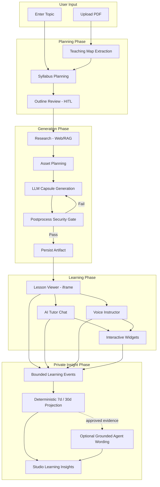

---

## License

See [`LICENSE`](./LICENSE) for usage terms.

## Author

Pramod Thebe
