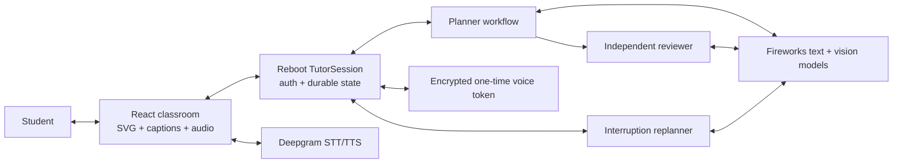

# SAT Live Tutor — MVP Product and Architecture Specification

**Status:** Implemented commercial beta MVP  
**Version:** 0.4  
**Date:** August 7, 2026

## Product promise

The lesson is the interface. A student pastes a complete SAT question or uploads a clear question image. The tutor solves and verifies the question, speaks like a patient teacher, and writes only the useful reasoning on a live board. The student can interrupt and ask why, request a visual explanation, or ask for a different method.

The classroom remains deliberately focused: one composer and no course navigation or teaching-tool picker. A separate commercial shell now gives the product a public landing page, private-beta pricing, and an authenticated student dashboard without cluttering the live lesson.

## Route surface

- `/` — public landing page with a representative voice-and-board product demonstration.
- `/pricing` — honest private-beta access page. Billing is not presented as working until it is actually enforced.
- `/dashboard` — authenticated student home showing the real current browser lesson or a first-lesson empty state.
- `/app` — authenticated live tutor classroom.

## MVP scope

### Included

1. Public commercial entry and authenticated browser product.
2. Multiline text questions for SAT Math and Reading & Writing.
3. One PNG or JPEG question image up to 4 MB, with optional typed context.
4. A planner pass followed by an independent reviewer pass.
5. A correction and re-review when the first lesson is rejected.
6. Short spoken teaching beats with matching captions.
7. Deepgram streaming TTS and conversational STT.
8. Pause, replay, new question, typed interruption, and voice interruption.
9. A deterministic teaching canvas supporting:
   - flowing text and KaTeX math;
   - lines, arrows, rectangles, circles, angles, brackets, and polylines;
   - function curves with explicit numeric coordinate markers;
   - numeric bar charts;
   - two-set Venn diagrams;
   - highlights, erase, clear, and camera focus.
10. Source-image rendering with aspect-correct normalized annotation coordinates.
11. Durable generation and replan workflows that may finish after a slow provider response.
12. A caption-and-board fallback if voice is unavailable.

### Excluded from this MVP

- PDF questions, camera capture, multi-page input, and OCR-only document ingestion.
- Persistence of the original uploaded image bytes. Reload restores the prepared lesson and summary, but the source image must be uploaded again for new image-aware follow-ups.
- Student drawing and selecting board objects.
- Cross-device lesson history, calculated progress analytics, practice generation, and mastery tracking. The current dashboard intentionally shows only the durable lesson available in the current browser session.
- Payments, subscriptions, school administration, and native mobile apps.

## Primary user flow

1. An unsigned visitor sees a focused landing-page product promise and can inspect honest beta access before signing in.
2. The signed-in student arrives in the classroom or dashboard.
3. The student pastes the complete question and choices or uploads one clear PNG/JPEG image.
4. The board shows the source question while the backend plans and verifies.
5. The UI continues observing durable state without a false client timeout.
6. After verification, the tutor begins speaking and applies board commands incrementally.
7. The student may pause, replay, type a follow-up, or speak.
8. An interruption clears queued speech, freezes valid board work, and starts a replacement explanation.
9. A replan must keep the previously verified final answer.
10. The final caption states the verified answer.

## Teaching behavior

The tutor must:

- explain what the problem asks before manipulating symbols;
- use short, conversational spoken segments;
- separate spoken prose from board notation;
- point out an SAT trap only when it is relevant;
- use a representation that directly advances the explanation;
- change representation after confusion rather than paraphrasing;
- state uncertainty or stop when verification fails.

The tutor must not expose hidden chain-of-thought, invent missing context, teach a rejected answer, or generate arbitrary HTML/SVG/JavaScript.

## Visual contract

The language model supplies semantic data. The renderer owns geometry, typography, scale, and collision rules.

### Function graph

- `curves[]` contains a checked `y=f(x)` formula and color.
- `markers[]` contains real numeric `x`, `y`, and label fields.
- Bounds must increase and every marker must lie inside them.
- A point may never be encoded as a constant curve.

### Bar chart

- `bars[]` contains a category label, nonnegative numeric value, display value, and color.
- The renderer computes axes, headroom, widths, and heights.
- Bar charts are only for distributions or genuine categorical comparisons.

### Venn diagram

- The model supplies two set labels and the left-only, overlap, right-only, and optional outside region text.
- The renderer owns the overlapping-circle geometry.

### Board composition

- Ordinary notes use measured flow layout.
- A highlight may target only an existing written note.
- Invalid highlight references are removed before review.
- One lesson uses at most one semantic visual family.
- A newly applied graph, bar chart, or Venn diagram replaces the previous visual panel.
- An uploaded source image is fitted without distortion, and normalized source annotations map to that fitted image rectangle.
- Existing source diagrams remain visible and are annotated directly rather than reconstructed beside the source.

## Architecture

### Browser

- React, TypeScript, Vite, Reboot generated hooks.
- Lightweight History API routing for the landing, pricing, dashboard, and classroom surfaces.
- Public pages do not construct tutor session state; protected pages pass through the Reboot OAuth session gate.
- React SVG and `foreignObject` layers.
- KaTeX for notation and MathJS for checked local curve evaluation.
- Deepgram audio playback and microphone capture.
- Browser-side image validation and preview; the permanent provider keys never enter the browser.
- A local generation counter prevents stale playback or polling results from changing the UI.

### Backend

- One `TutorSession` actor per random browser capability ID.
- Verified external OAuth callers and app-internal scheduled workflows are authorized.
- Writers move state to `thinking` and schedule durable workflows.
- Reboot Agent calls memoize LLM work across workflow replay.
- Generation checks prevent superseded workflows from overwriting newer state.
- Temporary Deepgram tokens are encrypted with Reboot Ciphertext and consumed once.

### Model path

- Text: `accounts/fireworks/models/deepseek-v4-flash-0731`.
- Image: `accounts/fireworks/models/qwen3p7-plus` with reasoning disabled for lower latency and three structured-output repair attempts.
- OpenAI-compatible Fireworks endpoint.
- Pydantic structured output on the backend and Zod validation in the browser.

## Failure behavior

- No browser deadline converts a slow durable workflow into a false failure.
- Status copy changes as a request takes longer and always leaves “New question” available.
- Backend `error` state is terminal for that generation and displays a concise student-facing message.
- Reviewer details are logged server-side, not exposed as a wall of internal diagnostics.
- Voice failure preserves captions and board animation.
- Reload restores a prepared lesson in a paused state.
- Unsupported image formats and files larger than 4 MB are rejected before provider work begins.

## Current acceptance evidence

- Quadratic: correct answer A, actual parabola, vertex `(2,-1)`, y-intercept `(0,3)`.
- Interruption: replacement explanation preserved the correct answer and used symmetry markers.
- Venn: 35% left-only, 25% overlap, 20% right-only, correct union C) 80%.
- Distribution: bars 0.20/0.50/0.30 with proportional SVG heights, correct expectation B) 1.1.
- Uploaded geometry: read the image, annotated the existing square/triangle directly, and verified C) 18.
- Automated: backend workflow/model tests, mypy, frontend renderer/reducer tests, and production build.

## Commercial launch requirements

The following are release gates, not hidden “optional tools”:

1. Configure a real production OAuth provider and bind sessions to account ownership.
2. Add per-account quotas, provider cost budgets, and abuse/rate limits.
3. Add billing and entitlement enforcement.
4. Run an SAT evaluation set and define an accuracy threshold.
5. Add structured logs, latency/cost metrics, alerts, and privacy-safe error reporting.
6. Publish privacy policy, terms, data retention, and AI-tutor limitations.
7. Deploy behind TLS and verify secure microphone/WebSocket behavior.
8. Resolve or formally accept the transitive Windows-only Hono static-serving advisory before a Windows deployment.
