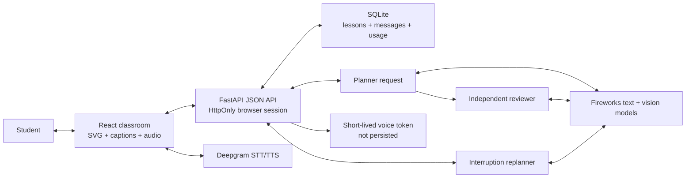

# SAT Live Tutor — MVP Product and Architecture Specification

**Status:** Implemented commercial beta MVP  
**Version:** 0.5  
**Date:** August 7, 2026

## Product promise

The lesson is the interface. A student pastes a complete SAT question or uploads a clear question image. The tutor solves and verifies the question, speaks like a patient teacher, and writes only the useful reasoning on a live board. The student can interrupt and ask why, request a visual explanation, or ask for a different method.

The tutor also reads work the student has done themselves. In "check my work" the student writes their own steps — on a whiteboard or in the text box — and the tutor finds the first one that breaks, explains the idea behind the slip, and hands back a hint rather than the answer.

The classroom is a chat thread with two named modes and no course navigation or teaching-tool picker. A separate commercial shell gives the product a public landing page, private-beta pricing, and a browser-local student dashboard without cluttering the live lesson.

## Route surface

- `/` — public landing page with a representative voice-and-board product demonstration.
- `/pricing` — honest private-beta access page. Billing is not presented as working until it is actually enforced.
- `/dashboard` — browser-local student home showing the current lesson or a first-lesson empty state.
- `/app` — live tutor classroom backed by the anonymous browser session.

## MVP scope

### Included

1. Public commercial entry and browser-scoped beta product.
2. Multiline text questions for SAT Math and Reading & Writing.
3. One PNG or JPEG question image up to 4 MB, with optional typed context.
4. A planner pass followed by an independent reviewer pass.
5. A correction and re-review when the first lesson is rejected.
5a. Diagnosis of the student's own written working, behind the same review gate.
5b. A student-writable Excalidraw whiteboard whose text elements become that working.
5c. Topic requests resolved into one representative question before planning, because
    every downstream contract assumes a specific question with a verifiable answer.
6. Short spoken teaching beats with matching captions.
7. Deepgram streaming TTS and conversational STT.
8. Pause, replay, new question, typed interruption, and voice interruption.
9. A deterministic teaching canvas supporting:
   - flowing text and KaTeX math;
   - lines, arrows, rectangles, circles, angles, brackets, and polylines;
   - function curves with explicit numeric coordinate markers;
   - numeric bar charts;
   - two-set Venn diagrams;
   - highlights, erase, clear, and camera focus.
10. Source-image rendering with aspect-correct normalized annotation coordinates.
11. Durable generation and replan workflows that may finish after a slow provider response.
12. A caption-and-board fallback if voice is unavailable.

### Excluded from this MVP

- PDF questions, camera capture, multi-page input, and OCR-only document ingestion.
- Persistence of the original uploaded image bytes. Reload restores the prepared lesson and summary, but the source image must be uploaded again for new image-aware follow-ups.
- Student drawing and selecting board objects.
- Cross-device lesson history, calculated progress analytics, practice generation, and mastery tracking. The current dashboard intentionally shows only the durable lesson available in the current browser session.
- Payments, subscriptions, school administration, and native mobile apps.
- Handwriting. Whiteboard working is typed, so nothing is recognised or transcribed.
- Tutor feedback drawn onto the student's own canvas; the verified board remains separate.

## Primary user flow

1. An unsigned visitor sees a focused landing-page product promise and can inspect honest beta access before signing in.
2. The signed-in student arrives in the classroom or dashboard.
3. The student pastes the complete question and choices or uploads one clear PNG/JPEG image.
4. The board shows the source question while the backend plans and verifies.
5. The UI continues observing durable state without a false client timeout.
6. After verification, the tutor begins speaking and applies board commands incrementally.
7. The student may pause, replay, type a follow-up, or speak.
8. An interruption clears queued speech, freezes valid board work, and starts a replacement explanation.
9. A replan must keep the previously verified final answer.
10. The final caption states the verified answer.

## Teaching behavior

The tutor must:

- explain what the problem asks before manipulating symbols;
- use short, conversational spoken segments;
- separate spoken prose from board notation;
- point out an SAT trap only when it is relevant;
- use a representation that directly advances the explanation;
- change representation after confusion rather than paraphrasing;
- state uncertainty or stop when verification fails.

The tutor must not expose hidden chain-of-thought, invent missing context, teach a rejected answer, or generate arbitrary HTML/SVG/JavaScript.

## Visual contract

The language model supplies semantic data. The renderer owns geometry, typography, scale, and collision rules.

### Function graph

- `curves[]` contains a checked `y=f(x)` formula and color.
- `markers[]` contains real numeric `x`, `y`, and label fields.
- Bounds must increase and every marker must lie inside them.
- A point may never be encoded as a constant curve.

### Bar chart

- `bars[]` contains a category label, nonnegative numeric value, display value, and color.
- The renderer computes axes, headroom, widths, and heights.
- Bar charts are only for distributions or genuine categorical comparisons.

### Venn diagram

- The model supplies two set labels and the left-only, overlap, right-only, and optional outside region text.
- The renderer owns the overlapping-circle geometry.

### Beat composition

- A beat carries two separate lists: `write` for text and math, `draw` for everything else.
  The planner reached for a geometry primitive when it meant to write, encoding labels as
  zero-length lines; splitting the choice removed that failure. Every beat must write at
  least one note, and `erase`/`clear`/`camera` are not part of the vocabulary.
- Writing is flattened ahead of drawing, so a highlight always resolves a target written
  earlier in the same beat.

### Board composition

- Ordinary notes use measured flow layout.
- A highlight may target only an existing written note.
- Invalid highlight references are removed before review.
- One lesson uses at most one semantic visual family.
- A newly applied graph, bar chart, or Venn diagram replaces the previous visual panel.
- An absolute label's coordinate is the point it names. The renderer centres the label on
  it, measures the real text, clamps it into its space, and separates overlapping labels.
  A fixed label box is never correct: the model cannot know rendered text width.
- Diagram space has y increasing downward. A question's own coordinates are converted, never
  copied, or the figure renders upside down and contradicts the explanation.
- An uploaded source image is fitted without distortion, and normalized source annotations map to that fitted image rectangle.
- An uploaded image stays visible as a compact reference, but is not annotated in place.
  `_normalize_lesson` strips every planner-authored `source`- and `diagram`-space command
  when an image is present, and `_inject_diagram` substitutes one trusted reconstruction
  compiled from the vision contract. Annotating the original directly would need that branch
  changed; today the enlarged copy is the only diagram a student sees.

## Architecture

### Browser

- React, TypeScript, Vite, and a small typed REST client.
- Lightweight History API routing for the landing, pricing, dashboard, and classroom surfaces.
- Public pages do not load tutor state; classroom and dashboard pages use the anonymous browser session.
- React SVG and `foreignObject` layers.
- KaTeX for notation and MathJS for checked local curve evaluation.
- Deepgram audio playback and microphone capture.
- Browser-side image validation and preview; the permanent provider keys never enter the browser.
- A local generation counter prevents stale playback or polling results from changing the UI.

### Backend

- FastAPI owns the `/api` contract and sets a random, HttpOnly `sat_session` cookie.
- SQLite stores one snapshot, ordered messages, and usage counters per browser session.
- Requests move state to `thinking`, call the provider, then store `ready` or `error`.
- Generation checks prevent superseded requests from overwriting newer state.
- Temporary Deepgram tokens are returned immediately and never persisted.
- The browser cookie is not user authentication; real accounts remain a release gate.

### Model path

- Text: `accounts/fireworks/models/deepseek-v4-flash-0731`.
- Image: `accounts/fireworks/models/qwen3p7-plus` with reasoning disabled for lower latency and three structured-output repair attempts.
- OpenAI-compatible Fireworks endpoint.
- Pydantic structured output on the backend and Zod validation in the browser.

## Failure behavior

- Provider work has a bounded server deadline and always leaves “New question” available.
- Backend `error` state is terminal for that generation and displays a concise student-facing message.
- Reviewer details are logged server-side, not exposed as a wall of internal diagnostics.
- Voice failure preserves captions and board animation.
- Reload restores a prepared lesson in a paused state.
- Unsupported image formats and files larger than 4 MB are rejected before provider work begins.

## Current acceptance evidence

Measured by the suites in `backend/eval/`, not by anecdote.

- Lessons, 16 questions across algebra, probability, statistics, sets, geometry,
  trigonometry, ratios, and four Reading & Writing types: 16/16 served with the correct
  answer, 0/16 beats left unwritten, no degenerate segments.
- Diagnoses, 12 pieces of student working with planted errors at known steps: 12/12 correct
  verdicts, 12/12 exact error steps, 0/6 false accusations on correct submissions, twice.
- Vision coordinate extraction is measured against a generated diagram with exact known
  vertices. Reasoning stays off: at `none` the model reports a perfectly symmetric figure
  (mean error 0.013, aspect 1.000); enabling it skews the figure and triples the error.
- Single runs are noisy — identical configurations have swung 14/16 → 16/16 → 15/16. Prefer
  the structural counters, which are enforced by code rather than luck.
- Automated: backend API/store/model tests, mypy, frontend renderer/reducer tests, production
  build. None of these can see a quality regression; only the evaluation suites can.

## Commercial launch requirements

The following are release gates, not hidden “optional tools”:

1. Add real authentication and bind every SQLite session to a verified account.
2. Add per-account quotas, provider cost budgets, and abuse/rate limits.
3. Add billing and entitlement enforcement.
4. Define an accuracy threshold. The evaluation set and its gate exist; the number does not.
5. Add structured logs, latency/cost metrics, alerts, and privacy-safe error reporting.
6. Publish privacy policy, terms, data retention, and AI-tutor limitations.
7. Deploy behind TLS and verify secure microphone/WebSocket behavior.
8. Resolve or formally accept the transitive Windows-only Hono static-serving advisory before a Windows deployment.
